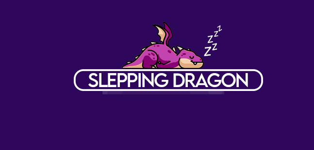

<p align="center">
  
</p>

<div align="center">
    <h1>
        <a>Sleeping Dragon Project</a>
    </h1>
    <h4><b>Welcome to Sleep Aid - Sleep Assistance Solution</b></h4>
    <h4>
        <a href="#Key Features">Key Features</a>
        •
        <a href="#How to Used">How to Use</a>
        •
        <a href="#Technologies Used">Technologies Used</a>
        •
        <a href="#Table of contents">Table of contents</a>
        •
        <a href="#Authors">Authors</a>
        •
        <a href="#copyright">Copyright</a>
    </h4>
    <h3>
        <a href="https://www.github.com/andiemmadavies">
            
        </a>
        <a href="https://www.triumphmayflowerclub.com/">
            
        </a>
        <a href="https://www.triumphmayflowerclub.com/news/2018/03/launchofthenewclubwebsite">
            
        </a>
        <a href="https://www.github.com/Stack-in-a-box/triumphmayflowerclub.com/commits/master">
            
        </a>
        <a href="https://www.github.com/Stack-in-a-box/triumphmayflowerclub.com/releases/latest">
            
        </a>
        <a href="#copyright">
            
        </a>
        <a href="https://www.facebook.com/triumphmayflowerclub">
            
        </a>
    </h3>
</div>

<div align="center">
  
</div>
<br>
Welcome to Sleep Aid - Sleep Assistance Solution, a natural product designed to enhance your sleep quality and help you effectively fall asleep. This README will provide you with an overview of the features and code structure, along with instructions on how to build and run the project.

##  Key Features 🗝️

**Responsive Design:** The website is designed using Bootstrap, ensuring seamless adaptability across various screen sizes, from mobile devices to desktop screens.

**Intuitive Navigation:** The top navigation bar allows smooth navigation through different sections of the site.

**Engaging Sections:** The site is divided into visually appealing sections, including the header section, Sleep Aid Dragon description section, and product images section.

**Product Description:** A detailed description of Sleep Aid Dragon's benefits is provided, emphasizing its clinically proven formula, non-habit-forming nature, and holistic approach to sleep enhancement.

**Captivating Images:** The product images section showcases a selection of images related to Sleep Aid Dragon, adding visual appeal to the site.

**Contact Form:** The contact section includes a form for visitors to get in touch with the team behind Sleep Aid Dragon.

## How to Use 📝

1. Clone this repository on your local machine:
```
git clone <REPOSITORY_URL>
```
2. Open the `index.html` file in your web browser to view the site.

3. Run ```sass styles.scss styles.css``` to ensure latest styles are available.

4. Explore the different sections of the site to learn more about Sleep Aid Dragon and its approach to improving sleep quality.

#### You can also view the live site at [Sleeping Dragon](https://linszay.github.io/SleepingDragon/).

## Technologies Used 🛸

- HTML5: The website's structure is built using HTML5 for semantic and efficient markup.

- CSS3: Visual styles are defined using CSS3, enabling an attractive design and consistent user experience.

- Bootstrap: The Bootstrap framework is utilized to achieve responsive design and intuitive navigation. 

## Table of contents 📚

- [Description](#description)
- [Header and Navigation](#header-and-navigation)
- [Benefits Section](#benefits-section)
- [Ribbon Section](#ribbon-section)
- [Footer](#footer)
- [Cookies](#cookies)
- [Styling Definitions for Webpage Design](#styling-definitions-for-webpage-design)
- [JavaScript Code](#javascript-code)
- [Copyright](#copyright)

## Description

Learning to develop a webpage using HTML, CSS, JavaScript, and Bootstrap offers an array of benefits. By mastering these fundamental technologies, you gain the power to create visually appealing and interactive websites that provide exceptional user experiences. HTML forms the structure of your content, CSS brings style and design to life, and JavaScript adds dynamic functionality. Additionally, Bootstrap accelerates development by providing a responsive framework and pre-designed components. This knowledge empowers you to craft engaging web solutions, making your digital presence captivating and ensuring you're well-equipped for a dynamic and creative career in web development.

## Header and Navigation
```html 
<header> 
      <nav class="navbar navbar-expand-lg bg-body-tertiary">
          <div class="container-fluid">
              <a class="navbar-brand navbar-logo" href="#">
                  
              </a>
              <a class="navbar-brand" href="#">
              <button class="navbar-toggler" type="button" data-bs-toggle="collapse" data-bs-target="#navbarNavAltMarkup" aria-controls="navbarNavAltMarkup" aria-expanded="false" aria-label="Toggle navigation">
                  <span class="navbar-toggler-icon"></span>
              </button>
              <div class="collapse navbar-collapse" id="navbarNavAltMarkup">
                <div class="navbar-nav">
                  <a class="nav-link-custom nav-link" aria-current="page" href="index.html">CAVE</a>
                  <a class="nav-link-custom nav-link" href="about.html">ABOUT THE DRAGON</a>
                  <a class="nav-link-custom nav-link" href="product.html">SHOP</a>
                  <a class="nav-link-custom nav-link" href="contact.html">CONTACT</a>
                  <a class="nav-link-custom nav-link disabled" aria-disabled="true"></a>
                </div>
              </div>
          </div>
      </nav>
    </header>
```

### **Navegation** bar Code  

The navigation bar in this HTML and Bootstrap code provides an easy-to-use navigation structure for the website. It is designed to be responsive and adapts to different screen sizes. It includes a linked brand logo, a hamburger button for mobile devices that expands the menu, and links to various sections of the site, such as the homepage, brand information, shop, and contact page. The navigation bar adheres to the colors and styles defined in the overall site design, delivering a consistent experience for users as they navigate through different pages.

  
### Usage of **Bootstrap** for navigation structure.

- Rapid Development: Bootstrap provides a collection of pre-designed and responsive components, styles, and layouts. This allows developers to quickly build and prototype websites and applications without having to create everything from scratch.

- Consistency: Bootstrap's consistent design and styling help ensure a cohesive and professional look across all pages and elements of a project. This is especially useful in maintaining a unified brand identity.

- Responsive Design: Bootstrap's responsive grid system makes it easy to create layouts that adapt seamlessly to various screen sizes, from mobile devices to desktops. This reduces the need for separate mobile and desktop versions of a site.

###  Benefits Section

The benefits section is designed as a container with a background image. It presents key benefits of the Sleep Aid Dragon product. The content highlights the clinically proven formula, non-habit forming nature, mood and focus enhancement, and the holistic approach to sleep wellness. The benefits are listed in an unordered list for clarity.

### Ribbon Section
A section with a row of images is provided, each displayed within a ribbon. This section might be intended to showcase related images or content.
```html
<section class="ribbon-section">
    <div class="container">
      <div class="row">
        <div class="col-md-3 col-6 ribbon-image">
          
        </div>
        <div class="col-md-3 col-6 ribbon-image">
          
        </div>
        <div class="col-md-3 col-6 ribbon-image">
          
        </div>
        <div class="col-md-3 col-6 ribbon-image">
          
        </div>
      </div>
    </div>
  </section>
```

### Footer
The footer contains footer links corresponding to the navigation links. Social media icons are included for various platforms. The footer also displays a copyright notice.
```html
<footer class="footer py-4">
      <div class="container">
          <div class="row align-items-center justify-content-center">
              <div class="custom-footer-links">
                <a href="index.html">CAVE</a>
                <a href="about.html">ABOUT THE DRAGON</a>
                <a href="#">SHOP</a>
                <a href="contact.html">CONTACT</a>
              </div>
              <div class="col-md-3 d-flex justify-content-center align-items-center">
                <div class="social-icons">
                    <a href=""></a>
                    <a href="#"></a>
                    <a href="#"></a>
                    <a href="#"></a>
                    <a href="#"></a>
                    <a href="#"></a>
                </div>
            </div>   
          </div>
      </div>
```
### Cookies
A cookie popup is included at the bottom, informing users about the use of cookies on the site and providing an "Accept" button.
```js
console.log("Script loaded");
const cookieButton = document.querySelector(".cookie-btn");
const cookiePopup = document.querySelector(".cookie-popup");

cookieButton.addEventListener("click", () => {
  cookiePopup.style.display = "none";
  localStorage.setItem("cookieConsent", "true");
});

window.addEventListener("load", () => {
  setTimeout(() => {
    if (!localStorage.getItem("cookieConsent")) {
      cookiePopup.style.display = "block";
    }
  }, 2000);
});
```

### Styling Definitions for Webpage Design

This code block defines the visual appearance of a webpage using CSS. It imports a Google Font for typography and sets up keyframes for animations. It also establishes variables for colors, typography sizes, and font families, providing a consistent visual theme throughout the site. The code encompasses header styling, navigation bar design, container properties, background images, responsive behavior, and customized footer and cookie pop-up components. This CSS code greatly influences the site's aesthetic and interaction, making it visually appealing and enhancing user experience.

```css
.contact-section {
  background-color: $primary-color; /* Cambiar el color de fondo */
  color: $font-color-small; /* Cambiar el color del texto */

  .contact-description {
    border-right: 2px solid $secondary-color; /* Agregar un borde lateral de color */
    padding-right: 20px; /* Agregar espacio en el lado derecho */
  }

  .contact-form {
    background-color: rgba(151, 219, 41, 0.5); /* Cambiar el color de fondo del formulario */
    padding: 54px; /* Añadir espacio interno */
    border-radius: 22px; /* Agregar bordes redondeados */
    margin-bottom: 100px;
  }
```

### Javascript-code
The code references an external JavaScript file named "scripts.js."


## Copyright

© 2023 Sleep Aid Dragon. All rights reserved.

## Author :pencil2:
 **Manuel Zambrano**:rage4: <br>
 **Lindsey Lancaster** :supervillain_woman:

---
 _**Sleep Aid - Sleep Assistance Solution** is designed to enhance sleep quality and ensure restful sleep. We hope you find this information helpful and that it provides you with a better understanding of the project!_


